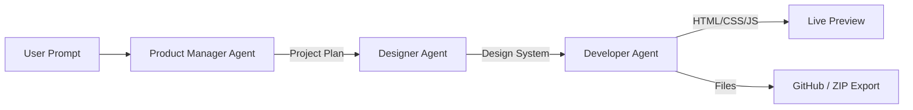

# ⚡ NexaBuild — Professional Agentic AI Website Builder


> Built for the HEC Generative AI Hackathon 2025 — turning text prompts into full‑stack, deployable web applications in seconds.

---

## 🚀 Overview

**NexaBuild** is an intelligent, multi‑agent AI platform that democratizes software development. Instead of only generating code snippets, NexaBuild orchestrates a team of AI agents to plan, design, and produce a fully functional, persistent web app from a simple natural‑language prompt (for example: "Build a personal finance tracker").

The platform generates a full front‑end project that can persist data on the client (LocalStorage / IndexedDB), be reviewed and edited in a live workspace, and be deployed immediately via GitHub Pages or downloaded as a ZIP.

---

## ✨ Key Features

- 🤖 Multi‑Agent AI Architecture
  - Product Manager Agent — analyzes requirements and creates a project plan.
  - Designer Agent — crafts a design system (colors, typography, UI style).
  - Developer Agent — writes robust HTML/CSS/JS with client‑side logic.
- 💾 Client‑Side Persistence — generated apps use LocalStorage or IndexedDB so they work without an external backend.
- 🛠 Live Developer Workspace — real‑time split‑screen preview and an embedded AI assistant (NexaBot) for interactive edits and debugging.
- ☁️ One‑Click Deployment — integration with the GitHub API to publish to GitHub Pages and generate a live URL; or export the site as a ZIP.

---

## 🏗 System Architecture

NexaBuild uses a chain of specialized agents (example diagram):



---

## 🛠 Installation & Setup

Prerequisites
- Python 3.10+
- A Google Gemini API key (or the generative AI provider credentials you intend to use)
- Git (optional, for cloning and deploying)

1. Clone the repository

```bash
git clone https://github.com/Aqibahmed12/NexaBuild.git
cd NexaBuild
```

2. Create a virtual environment (recommended) and install dependencies

```bash
python -m venv .venv
# On macOS/Linux
source .venv/bin/activate
# On Windows PowerShell
.venv\Scripts\Activate.ps1

pip install -r requirements.txt
```

Dependencies include: streamlit, google-generativeai (or your provider's SDK), requests, and other packages listed in requirements.txt.

3. Configure API keys

Option A — Streamlit secrets file:
Create `.streamlit/secrets.toml` with:

```toml
API_KEY = "YOUR_GEMINI_API_KEY"
GITHUB_TOKEN = "YOUR_GITHUB_TOKEN" # Optional: for GitHub deploy
```

Option B — Environment variables:
Set `API_KEY` and optionally `GITHUB_TOKEN` in your shell or CI environment.

4. Run the application

```bash
streamlit run main.py
```

The app should open locally (usually at http://localhost:8501).

---

## 📖 How to Use

- Create: On the Home tab, enter your app idea (e.g., "A To‑Do list app with a dark neon theme") and click Generate.
- Visualize: Watch the agents (Product Manager, Designer, Developer) communicate and build your app in real time.
- Refine: Use the Workspace to chat with the team or directly edit code. Example prompts: "Change the background to blue" or "Add a delete button".
- Deploy: On the Deploy tab, provide a GitHub token to publish to GitHub Pages, or download the generated source code as a ZIP.

---

## ⚙️ Notes and Limitations

- The current default persistence is client‑side (LocalStorage / IndexedDB). For production apps requiring server persistence, integrate a backend or cloud database.
- Model usage may incur costs from your AI provider; monitor API usage and quotas.
- Generated apps should be reviewed and tested before public deployment.

---

## 👥 Team

- Aqib Ahmed — Lead Developer & AI Architect  
- Sanaullah — Frontend & UI/UX  
- Komal — Documentation & Research  
- Tahir — Support

---

## 📄 License

This project is open‑source and available under the MIT License. See LICENSE for details.

---

<div align="center">
  <sub>Made with ❤️ by the NexaBuild Team for the HEC Generative AI Hackathon</sub>
</div>
```
